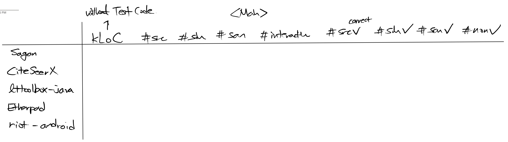

# Evaluation Section

## RQs

본 페이퍼를 통해 말하고자 하는 것:

> Interactive Inference는 Batch-Processed, Data-Driven Method보다 수동적인 분류 작업의 양을 덜 필요로 한다.

RQ로 쪼개면:

1. How **efficient** is SpecHunter in finding src/sin/san?
2. How **effective** is SpecHunter in finding src/sin/san?
3. How **precise** is SpecHunter (i.e. creates less false negatives)?

## Responding to RQ1 and RQ2

Main table of this paper:

- Table Rows:
  - Sagan with other Open source Java web applications, collected from the wiki article: https://en.wikipedia.org/wiki/List_of_free_and_open-source_web_applications
    - All applications containing significant amount of Java
      - Why Web?: Web apps are the best example of world-facing applications where any program input can be malicious, thus ideal for studying inhabited methods
  - `Sagan` is a webserver backend application (powers spring.io)
  - `CiteSeerX` is the backend code that powers the digital library
  - `lttoolbox-java` is 
  
- Table Columns:
  - kLoCs are measured excluding unit tests
  - Total # of sources, sinks, sanitizers in this project
  - Total # of asked questions
  - # of correctly classified sources, sinks, sanitizers, and nones
  
### RQ1

- This RQ tries to answer the main claim that using SH reduces manual classifications.
- Measured in two indices:
  - #(interaction) / #(src) + #(sin) + #(san).
  - #(interaction) / #(all methods in the project).

### RQ2

- This RQ attempts to investigate into the True Positive Rate of SpecHunter.
- Effectiveness is measured in #(correctly classified methods of the label)/#(all methods with the label)
  - where label is either src/sin/san.

### RQ3

We need a small table.

## Discussions

- `riot-android` repo 
